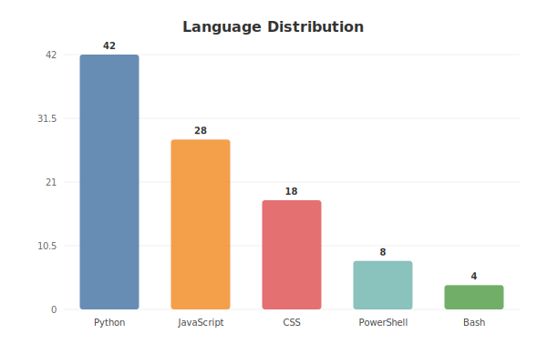
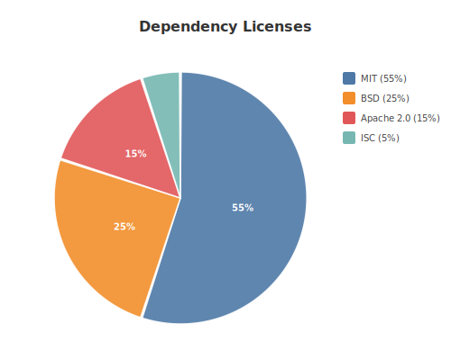
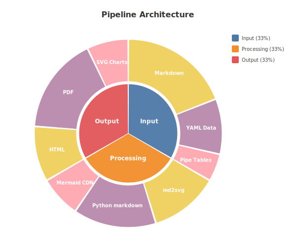
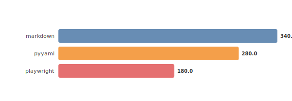

# md2pdf

**Markdown → styled HTML + PDF converter with inline chart generation from YAML data blocks.**

Convert Markdown documents to professionally styled PDFs with support for tables, Mermaid diagrams, and `@chart` data visualizations — all from a single command.

## Features

- **One command** — `./md2pdf.sh doc.md` handles everything
- **@chart blocks** — embed YAML data in Markdown, get SVG charts automatically
- **Mermaid diagrams** — fenced `mermaid` blocks rendered via CDN
- **GitHub alerts** — `> [!NOTE]`, `> [!WARNING]`, etc. render as styled callout boxes
- **Math/LaTeX** — `$inline$` and `$$block$$` math via KaTeX
- **Syntax highlighting** — fenced code blocks with language tags via Highlight.js
- **Task lists** — `- [ ]` / `- [x]` render as styled checkboxes
- **Page breaks** — `<!-- pagebreak -->` for multi-page document control
- **YAML frontmatter** — per-document title, author, theme, image scale
- **Themes** — three bundled CSS themes (default, academic, minimal) or bring your own
- **Idempotent** — auto-installs dependencies on first run
- **Non-destructive** — never overwrites existing PDFs (auto-increments `_1`, `_2`, ...)

## Quick Start

```bash
# Clone and convert a document
git clone https://github.com/dcuccia/md2pdf.git
cd md2pdf
./md2pdf.sh "../path/to/document.md"

# Windows
md2pdf.bat "path\to\document.md"
```

Dependencies (Python `markdown`, `pyyaml`, Node.js `playwright`) are installed automatically on first run.

## @chart: Inline Data Visualization

Embed chart data directly in your Markdown as YAML. The `@chart` convention generates SVGs that render on GitHub *and* in PDFs.

### Bar Chart

```yaml
# @chart → docs/images/readme-languages.svg
type: bar
title: Language Distribution
data:
  Python: 42
  JavaScript: 28
  CSS: 18
  PowerShell: 8
  Bash: 4
```



### Pie Chart

```yaml
# @chart → docs/images/readme-license-compat.svg
type: pie
title: Dependency Licenses
data:
  MIT: 55
  BSD: 25
  Apache 2.0: 15
  ISC: 5
```



### Sunburst Chart

```yaml
# @chart → docs/images/readme-architecture.svg
type: sunburst
title: Pipeline Architecture
data:
  Input:
    Markdown: 40
    YAML Data: 20
    Pipe Tables: 10
  Processing:
    md2svg: 25
    Python markdown: 30
    Mermaid CDN: 15
  Output:
    HTML: 20
    PDF: 35
    SVG Charts: 15
```



### Pipe Table (Inline Data + Chart)

Data visible as a table *and* rendered as a chart:

<!-- @chart: hbar → docs/images/readme-deps.svg -->
| Dependency | Size (KB) |
|-----------|-----------|
| markdown | 340 |
| pyyaml | 280 |
| playwright | 180 |



## Themes

```bash
./md2pdf.sh "doc.md"                              # default (blue professional)
./md2pdf.sh --theme themes/academic.css "doc.md"   # serif journal style
./md2pdf.sh --theme themes/minimal.css "doc.md"    # clean GitHub style
```

| Theme | Font | Style |
|-------|------|-------|
| `default` | Segoe UI / Helvetica | Blue accents, datasheet feel |
| `academic` | Georgia / Times | Gray accents, journal feel |
| `minimal` | System sans-serif | Neutral, GitHub-like |

## How It Works

```
document.md ──→ lib/md2svg.py ──→ *.svg charts
     │                            │
     └──→ Python markdown ──→ styled HTML ──→ Playwright ──→ PDF
              (+ CSS theme)       (+ Mermaid CDN)    (headless Chromium)
```

1. **Step 0** — `lib/md2svg.py` scans for `@chart` blocks and generates SVG files
2. **Step 1** — Python `markdown` converts MD → HTML with the selected CSS theme
3. **Step 2** — Transform pipeline processes alerts, math, syntax highlighting, task lists, page breaks
4. **Step 3** — Playwright renders HTML → PDF via headless Chromium (with Mermaid support)

## GitHub-Native Features

md2pdf's transform pipeline ensures that Markdown features that render natively on GitHub also render correctly in PDF output:

| Feature | Markdown syntax | PDF rendering |
|---------|----------------|---------------|
| Alerts | `> [!NOTE]` / `> [!WARNING]` / etc. | Styled callout boxes with icons |
| Math | `$E=mc^2$` / `$$\int f(x)dx$$` | KaTeX-rendered equations |
| Syntax highlight | `` ```python `` | Highlight.js colored code |
| Task lists | `- [ ]` / `- [x]` | Styled checkboxes |
| Page breaks | `<!-- pagebreak -->` | CSS page breaks |
| Frontmatter | `---\ntitle: ...\n---` | Title in HTML `<head>`, image scale overrides |
| Mermaid | `` ```mermaid `` | CDN-rendered diagrams |

## File Structure

```
md2pdf/
├── md2pdf.ps1        # PowerShell converter (Windows)
├── md2pdf.sh         # Bash converter (Linux/macOS)
├── md2pdf.bat        # Batch wrapper
├── lib/
│   ├── md2svg.py     # @chart SVG generator
│   ├── md2html.py    # MD → HTML conversion
│   └── html2pdf.js   # HTML → PDF rendering
├── package.json      # Node.js dependencies + scripts
├── requirements.txt  # Python dependencies
├── themes/
│   ├── default.css   # Professional blue theme
│   ├── academic.css  # Serif journal theme
│   └── minimal.css   # Clean neutral theme
├── tests/            # pytest + Jest test suites
└── docs/
    ├── guide.md      # Full user guide
    └── images/       # Generated chart SVGs
```

## Dependencies

| Package | License | Purpose |
|---------|---------|---------|
| [markdown](https://pypi.org/project/Markdown/) | BSD | MD → HTML conversion |
| [pyyaml](https://pypi.org/project/PyYAML/) | MIT | @chart YAML parsing |
| [playwright](https://www.npmjs.com/package/playwright) | Apache 2.0 | HTML → PDF rendering |

## License

[MIT](LICENSE) — David Cuccia

## Related

- [md2pdf-vscode](https://github.com/dcuccia/md2pdf-vscode) — VS Code extension for right-click export to HTML/PDF
