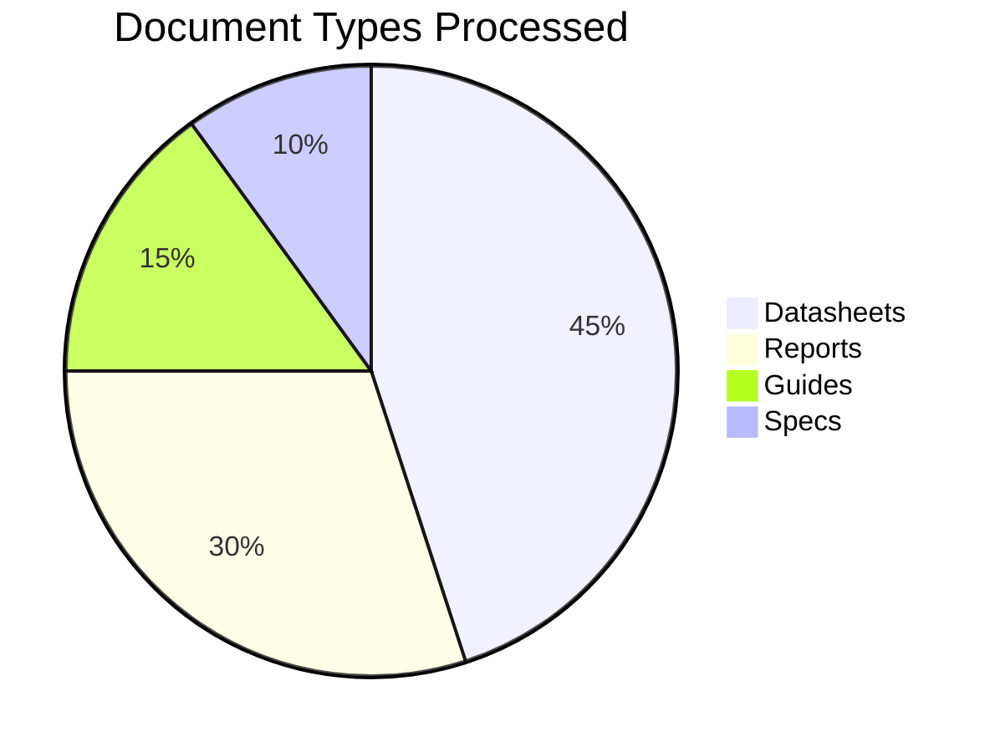
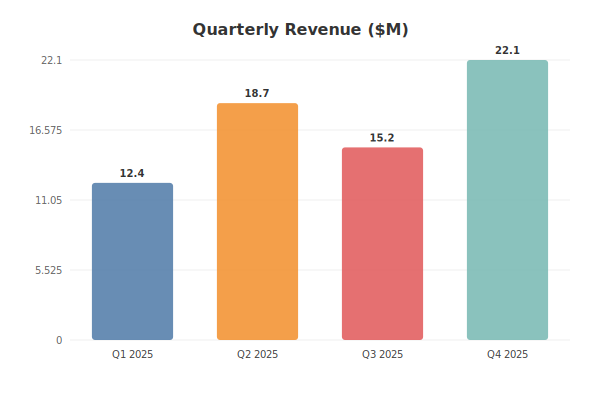
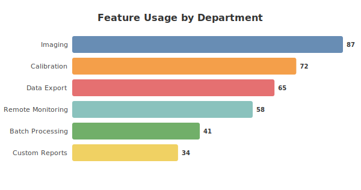
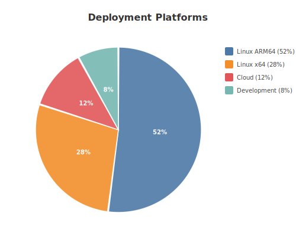
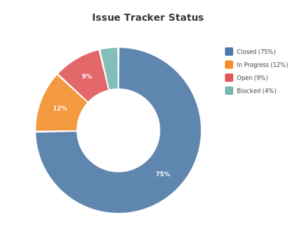
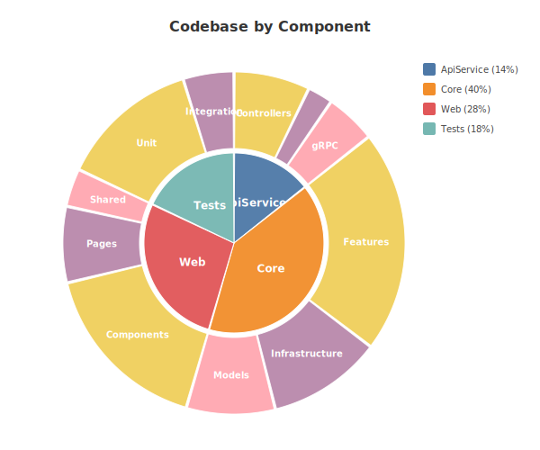
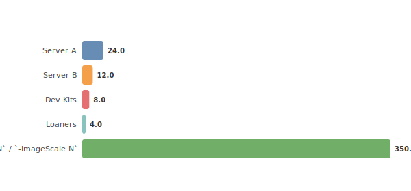

# md2pdf User Guide

*Markdown → HTML → PDF conversion with chart generation, Mermaid rendering, and styled output.*

---

## Overview

`md2pdf` converts Markdown documents to styled PDFs via an HTML intermediate, with support for:

- **Tables, images, and standard Markdown** — rendered with configurable CSS themes
- **Mermaid diagrams** — fenced `mermaid` code blocks rendered to SVG via the Mermaid CDN
- **@chart data blocks** — YAML or pipe-table data automatically converted to SVG charts

The tool is idempotent (installs dependencies on first run) and never overwrites existing PDFs — it auto-increments filename suffixes (`_1`, `_2`, ...).

## Quick Start

```bash
# Convert a specific file
./md2pdf.sh "../My Document.md"

# Convert all .md files in the parent directory
./md2pdf.sh

# Windows
md2pdf.bat "path\to\file.md"
```

### Dependencies (auto-installed)

| Dependency | Purpose | Install Method |
|-----------|---------|---------------|
| Python `markdown` | MD → HTML conversion | `pip install markdown` |
| Python `pyyaml` | @chart YAML parsing | `pip install pyyaml` |
| Playwright (Node.js) | HTML → PDF via headless Chromium | `npm install playwright` |

All dependencies are installed automatically on first run. Playwright is installed locally into the `node_modules/` directory — no global install required.

## Features

### Standard Markdown

Tables, blockquotes, lists, code blocks, images, and horizontal rules are all supported and styled by the bundled CSS themes.

| Feature | Support |
|---------|---------|
| Tables | ✅ Styled with header coloring |
| Images | ✅ Scaled via `--image-scale` |
| Code blocks | ✅ Syntax-highlighted via Highlight.js |
| Blockquotes | ✅ Styled with left border |
| Mermaid diagrams | ✅ CDN-rendered to SVG |
| @chart blocks | ✅ Auto-generated SVG |
| GitHub alerts | ✅ `> [!NOTE]`, `> [!WARNING]`, etc. |
| Math/LaTeX | ✅ `$inline$` and `$$block$$` via KaTeX |
| Task lists | ✅ `- [ ]` / `- [x]` as styled checkboxes |
| Page breaks | ✅ `<!-- pagebreak -->` for PDF pagination |
| YAML frontmatter | ✅ title, author, image_scale overrides |

### Mermaid Diagrams

Standard Mermaid fenced code blocks are rendered using the Mermaid v11 CDN:



Mermaid supports flowcharts, sequence diagrams, pie charts, Gantt charts, and more. See [mermaid.js.org](https://mermaid.js.org/) for the full syntax reference.

### @chart Blocks (SVG Generation)

For charts that Mermaid doesn't support (or where you want agent-generated visualizations from data), use `@chart` blocks. These embed chart data directly in your Markdown as YAML or pipe tables, and `md2pdf` generates SVG files automatically during conversion.

#### How It Works

1. Add a YAML fenced block with a `# @chart → filename.svg` comment on the first line
2. Include `type`, `title`, and `data` fields
3. Reference the SVG with `` immediately after
4. Run `md2pdf` — it generates the SVG before converting to HTML/PDF

**On GitHub:** readers see the YAML data block (syntax-highlighted) and the rendered SVG chart image. Both the data and visualization are colocated in the document.

**In PDF output:** the same SVG is embedded in the PDF via the HTML intermediate.

## Chart Types

### Bar Chart

Vertical bars from flat key:value data.

```yaml
# @chart → guide-quarterly-revenue.svg
type: bar
title: Quarterly Revenue ($M)
data:
  Q1 2025: 12.4
  Q2 2025: 18.7
  Q3 2025: 15.2
  Q4 2025: 22.1
```



### Horizontal Bar Chart

Horizontal bars — useful when labels are long.

```yaml
# @chart → guide-feature-usage.svg
type: hbar
title: Feature Usage by Department
data:
  Imaging: 87
  Calibration: 72
  Data Export: 65
  Remote Monitoring: 58
  Batch Processing: 41
  Custom Reports: 34
```



### Pie Chart

Proportional segments from flat key:value data. Add `donut: true` for a donut variant.

```yaml
# @chart → guide-platform-share.svg
type: pie
title: Deployment Platforms
data:
  Linux ARM64: 52
  Linux x64: 28
  Cloud: 12
  Development: 8
```



### Donut Chart

Same as pie with a hollow center.

```yaml
# @chart → guide-issue-status.svg
type: donut
title: Issue Tracker Status
data:
  Closed: 142
  In Progress: 23
  Open: 18
  Blocked: 7
```



### Sunburst Chart

Hierarchical nested data rendered as concentric rings. Inner rings are parent categories; outer rings are children.

```yaml
# @chart → guide-codebase-structure.svg
type: sunburst
title: Codebase by Component
data:
  ApiService:
    Controllers: 12
    Middleware: 4
    gRPC: 8
  Core:
    Features: 35
    Infrastructure: 18
    Models: 14
  Web:
    Components: 28
    Pages: 12
    Shared: 6
  Tests:
    Unit: 22
    Integration: 8
```



## Pipe Table Alternative

For flat data where the **table itself adds document value**, use an HTML comment tag above a standard pipe table:

<!-- @chart: hbar → guide-device-inventory.svg -->
| Device | Count |
|--------|-------|
| Server A | 24 |
| Server B | 12 |
| Dev Kits | 8 |
| Loaners | 4 |



With this approach, GitHub renders both the table (as a formatted table) and the SVG image. The HTML comment is invisible in rendered Markdown but signals `md2pdf` to generate the chart.

## Themes

md2pdf ships with three CSS themes. Use the `--theme` flag to select one:

```bash
# Default: professional blue-accented theme
./md2pdf.sh "doc.md"

# Academic: serif-based, journal-style
./md2pdf.sh --theme themes/academic.css "doc.md"

# Minimal: clean GitHub-style
./md2pdf.sh --theme themes/minimal.css "doc.md"
```

| Theme | Font | Accent | Best For |
|-------|------|--------|----------|
| `default` | Segoe UI / Helvetica | Blue (#0f3460) | Datasheets, technical docs |
| `academic` | Georgia / Times | Gray (#555) | Papers, reports, journals |
| `minimal` | System sans-serif | Neutral (#e1e4e8) | README-style, clean docs |

Custom themes: create a CSS file following the patterns in `themes/` and pass its path via `--theme`.

## Usage Reference

### Command Line

```
# Linux / macOS
./md2pdf.sh [OPTIONS] [path/to/file.md]

# Windows
md2pdf.bat [OPTIONS] [path\to\file.md]
.\md2pdf.ps1 [OPTIONS] [path\to\file.md]
```

### Options

| Option | Default | Description |
|--------|---------|-------------|
| `--image-scale N` / `-ImageScale N` | 350 | Header image height in pixels |
| `--theme PATH` / `-Theme PATH` | `themes/default.css` | CSS theme file |
| `-h` / `--help` | — | Show help text |

### Behavior

- **No file specified:** converts all `.md` files in the parent directory
- **Never overwrites:** existing PDFs get `_1`, `_2`, etc. suffixes
- **Relative paths:** resolved against the `md2pdf/` script directory's parent
- **SVG generation:** runs automatically before HTML conversion if `lib/md2svg.py` is present

### Standalone SVG Generation

You can generate charts without producing a PDF:

```bash
# Generate all @chart SVGs from a document
python lib/md2svg.py "../My Document.md"

# List @chart blocks without generating
python lib/md2svg.py "../My Document.md" --list
```

## File Structure

```
md2pdf/
├── md2pdf.ps1          # PowerShell converter (Windows primary)
├── md2pdf.sh           # Bash converter (Linux/macOS)
├── md2pdf.bat          # Windows batch wrapper
├── lib/
│   ├── md2svg.py       # @chart SVG generator
│   ├── md2html.py      # MD → HTML conversion
│   └── html2pdf.js     # HTML → PDF rendering (Playwright)
├── package.json        # Node.js dependencies + scripts
├── requirements.txt    # Python dependencies
├── themes/
│   ├── default.css     # Professional blue theme
│   ├── academic.css    # Serif-based journal theme
│   └── minimal.css     # Clean neutral theme
├── tests/              # pytest + Jest test suites
├── docs/
│   ├── guide.md        # This user guide
│   └── images/         # Generated chart SVGs
└── node_modules/       # Local Playwright install (auto-created)
```

## Workflow with AI Coding Agents

The `@chart` convention is designed for agent-assisted document authoring:

1. **Author** writes the document with YAML data blocks specifying chart type and data
2. **Agent** reads the Markdown, finds `# @chart →` blocks, and generates SVG files
3. **Both** are committed together — the YAML is the source of truth, the SVG is derived

To regenerate charts after data changes, ask the agent to *"update charts in this document"* or run:

```bash
python lib/md2svg.py "path/to/document.md"
```

### Convention Reference

**YAML block** (for all chart types, especially hierarchical data):
````
```yaml
# @chart → output-filename.svg
type: bar|hbar|pie|donut|sunburst
title: Chart Title
data:
  Label1: 42
  Label2: 28
```
````

**Pipe table** (for flat data where the table adds document value):
```
<!-- @chart: bar → output-filename.svg -->
| Label  | Value |
|--------|-------|
| Item A | 42    |
| Item B | 28    |
```

Both must be followed by `` to display the chart.

---

## GitHub-Native Features

md2pdf includes a transform pipeline that converts GitHub-native Markdown features into styled HTML for PDF output.

### Alerts (Callout Boxes)

GitHub-style alerts render as styled callout boxes in PDF output:

```markdown
> [!NOTE]
> Useful information for users.

> [!TIP]
> Helpful advice for best results.

> [!IMPORTANT]
> Critical information users need to know.

> [!WARNING]
> Dangerous operations or important caveats.

> [!CAUTION]
> Potential negative consequences of an action.
```

All five alert types (`NOTE`, `TIP`, `IMPORTANT`, `WARNING`, `CAUTION`) are supported with distinct colors and icons.

### Math / LaTeX

Inline and block math expressions are rendered via KaTeX:

```markdown
Inline math: $E = mc^2$

Block math:

$$
\int_0^\infty e^{-x^2} dx = \frac{\sqrt{\pi}}{2}
$$
```

KaTeX scripts are only injected when math delimiters are detected — no overhead for documents without math.

### Syntax Highlighting

Fenced code blocks with language tags get client-side syntax highlighting via Highlight.js:

````markdown
```python
def fibonacci(n):
    a, b = 0, 1
    for _ in range(n):
        a, b = b, a + b
    return a
```
````

### Task Lists

GitHub-style task lists render as styled checkboxes:

```markdown
- [ ] Incomplete task
- [x] Completed task
```

### Page Breaks

Insert explicit page breaks for PDF output:

```markdown
Content before the break.

<!-- pagebreak -->

Content on a new page.
```

### YAML Frontmatter

Set document metadata and override defaults:

```markdown
---
title: Project Report
author: Jane Doe
date: 2025-01-15
image_scale: 500
---

# Project Report

Document body follows...
```

Supported frontmatter keys:

| Key | Effect |
|-----|--------|
| `title` | Sets HTML `<title>` tag |
| `author` | Document metadata (future: header/footer) |
| `date` | Document metadata (future: header/footer) |
| `image_scale` | Override `--image-scale` for SVG chart sizing |

### Adding Custom Transforms

The transform pipeline in `lib/md2html.py` follows a dispatch pattern. To add a new transform:

1. Write a function: `def transform_feature(html: str) -> tuple[str, list[str], list[str]]`
2. Register it in the `TRANSFORMS` list
3. Add CSS support in all `themes/*.css` files (use `md2pdf-` class prefix)
4. Add tests in `tests/test_md2html.py`
