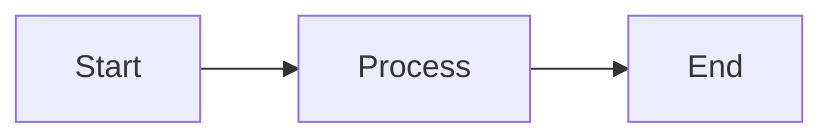

# Sample Document for Testing

*A test document exercising all md2pdf features.*

---

## Tables

| Feature | Status |
|---------|--------|
| Tables | ✅ |
| Charts | ✅ |
| Mermaid | ✅ |

## Bar Chart

```yaml
# @chart → test-bar.svg
type: bar
title: Test Bar Chart
data:
  Alpha: 40
  Beta: 30
  Gamma: 20
  Delta: 10
```


## Horizontal Bar Chart

```yaml
# @chart → test-hbar.svg
type: hbar
title: Test HBar Chart
data:
  Long Label One: 80
  Short: 60
  Medium Label: 40
```


## Pie Chart

```yaml
# @chart → test-pie.svg
type: pie
title: Test Pie Chart
data:
  Slice A: 50
  Slice B: 30
  Slice C: 20
```


## Donut Chart

```yaml
# @chart → test-donut.svg
type: donut
title: Test Donut Chart
data:
  Inner: 60
  Outer: 40
```


## Sunburst Chart

```yaml
# @chart → test-sunburst.svg
type: sunburst
title: Test Sunburst Chart
data:
  Group A:
    Sub 1: 30
    Sub 2: 20
  Group B:
    Sub 3: 25
    Sub 4: 15
  Group C:
    Sub 5: 10
```


## Pipe Table Chart

<!-- @chart: hbar → test-pipe.svg -->
| Item | Value |
|------|-------|
| Foo | 100 |
| Bar | 75 |
| Baz | 50 |


## Mermaid Diagram



## Code Block

```python
def hello():
    print("Hello, world!")
```

## Blockquote

> This is a blockquote used to test theme styling.

## Alerts

> [!NOTE]
> This is a note alert.

> [!WARNING]
> This is a warning alert.

> [!TIP]
> This is a tip alert.

> [!IMPORTANT]
> This is an important alert.

> [!CAUTION]
> This is a caution alert.

## Task Lists

- [ ] Incomplete task
- [x] Completed task
- [ ] Another incomplete task

## Math

Inline math: $E = mc^2$

Block math:

$$
\int_0^\infty e^{-x^2} dx = \frac{\sqrt{\pi}}{2}
$$

## Page Break

<!-- pagebreak -->

## After Page Break

This content appears on a new page.

## Nested List

- Item 1
  - Sub-item 1a
  - Sub-item 1b
- Item 2
- Item 3
